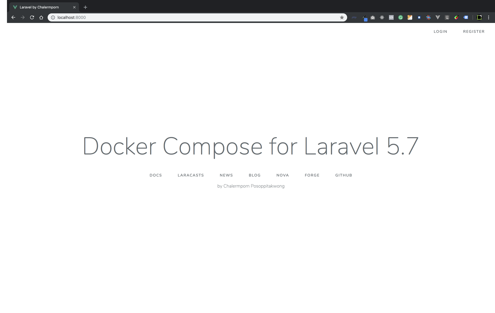
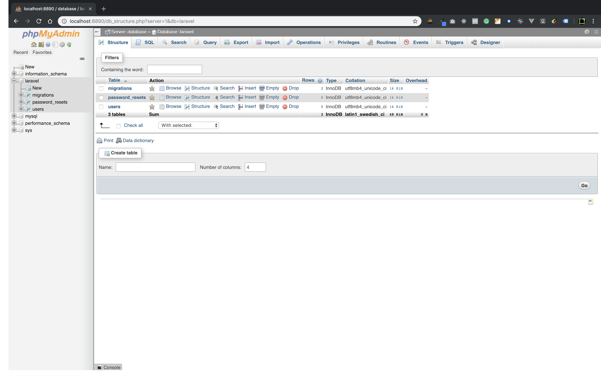

## About Docker Compose Laravel

# Features

- php:7.1-fpm
- nginx:1.10
- mysql 5.7
- phpMyAdmin
- laravel 5.7

## Run Docker Compose

### build images

 `$ docker-compose -f docker-compose.yml build --force-rm`

### run

`$ docker-compose -f docker-compose.yml up`
